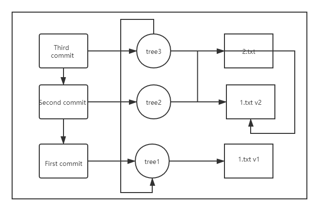

## GIT概述
GIT的核心是一个简单的键值数据库，向数据库插入任意类型的内容，它会返回一个键值，可以通过该键值检索


## GIT对象

**相关命令**

```shell
# 向数据库写入内容并写入对应的键值
git hash-object -w --stdin
# -w 参数决定是否写入数据库

# git对象存在的目录
find ./.git/objects/ -type f

# 根据键值拉取数据
git cat-file -p $hash

# 查看类型
git cat-file -t $hash

# 键值对在git内部是一个blob类型
```
**对文件进行简单的版本控制**
```shell
# 创建文件并将其内容写入数据库
git hash-object -w ./test.txt

# 每个git对象不能代表项目快照，只是记住一个文件的每一个版本
```
**问题：**

    1. 记住文件的每一个版本所对应的hash值不现实
    2. 在GIT中文件名没有被保存，仅保存了文件的内容
    不涉及暂存区

## 树对象

    树对象解决文件名保存的问题，也允许我们将多个文件组织到一起
    - 树对象对应UNIX的目录项
    - git对象大致对应文件的内容

**构建树对象**
```shell
# update-index 放到暂存区中
git update-index --add --cacheinfo 文件模式 $hash $filename

--add: 当前文件并不在暂存区中，首次需要--add
--cahcheinfo：要添加的对象不在当前目录而在数据库中

# 查看暂存区
git ls-files -s
# 暂存区的覆盖是针对于每一个文件而言的

##################
#文件模式：
100644，普通文件
100755，可执行文件
120000，符号链接
##################


# 生成暂存区快照，即将暂存区内容存到版本库中
git write-tree
# 执行完此命令后暂存区不会被清空
# 暂存区在下一次--add时会被覆盖掉
# 此命令此时生成一个树对象，类型为tree

git read-tree --prefix=bak $树对象hash
```

```shell
# 生成git对象与放到暂存区合并
git update-index --add $filename
```
**总结**

git对象代表文件的一个版本，树对象代表项目的一个版本

## 提交对象


```shell
# 提交对象
echo "first commit" | git commit-tree $树对象hash
git commit-tree $树对象hash $父提交对象

# git commit-tree不但生成提交对象，而且会将对应的快照（树对象）提交到本地库中
# 查看提交对象
git cat-file -p
```

    直接访问的是提交对象
    提交对象是对树对象做了一次封装，加入了一些描述信息
    提交对象是链式的

关系图
