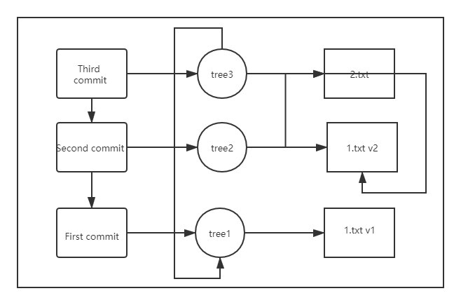

```shell
# 提交对象
echo "first commit" | git commit-tree $树对象hash
git commit-tree $树对象hash $父提交对象

# git commit-tree不但生成提交对象，而且会将对应的快照（树对象）提交到本地库中
git cat-file -p
```
直接访问的是提交对象
提交对象是对树对象做了一次封装，加入了一些描述信息
提交对象是链式的

关系图
